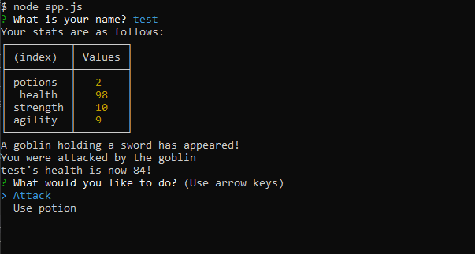

# jest-another-rpg

- Github URL: https://github.com/DanielCConlon/jest-another-rpg

## Table-of-Contents

- [Description](#description)
- [Usage](#usage)
- [Application](#application)

## [Description](#description)

Jest Another RPG is a command-line role-playing game created by following the steps of a course module on Inquirer, Object Oriented Programming, and Test Driven Development.

## [Usage](#table-of-contents)

Clone the repo and run npm i to download all of the npm packages. Run `node app.js` and follow the inquirer prompts.

## [Application](#table-of-contents)

